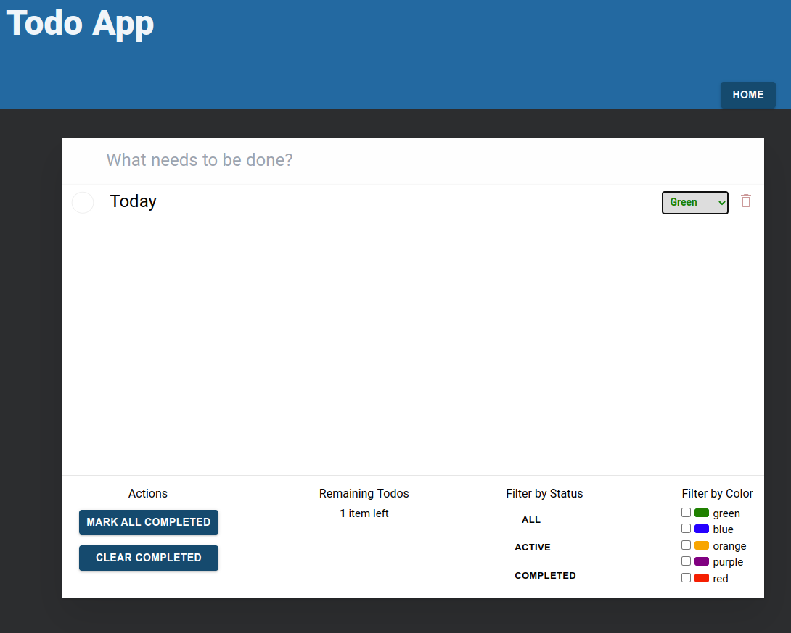
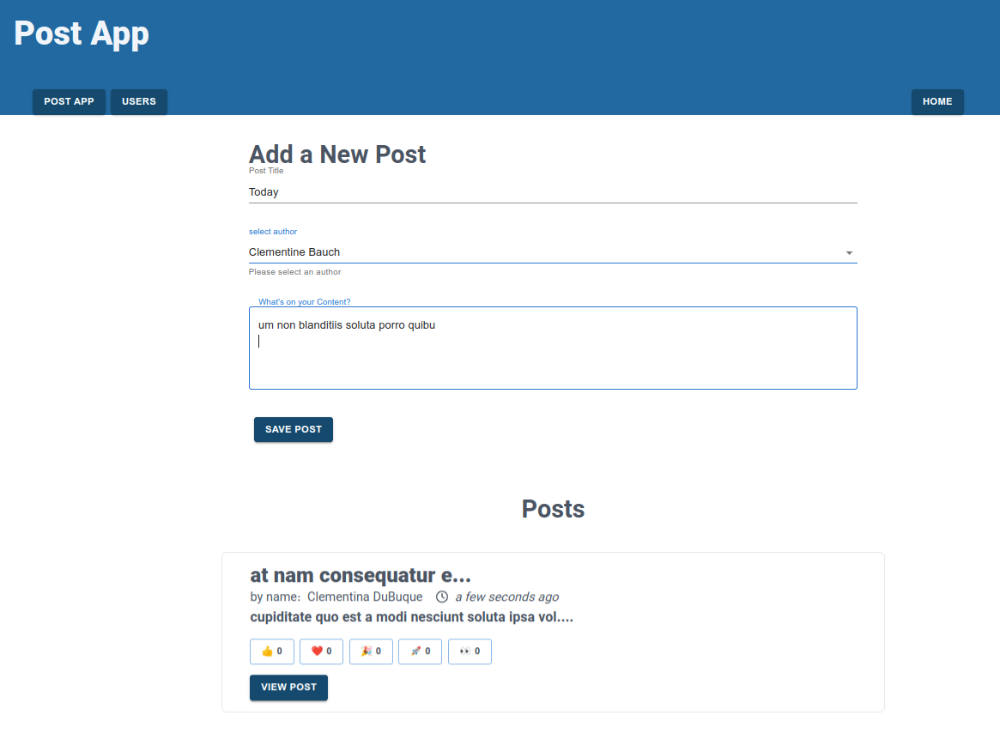
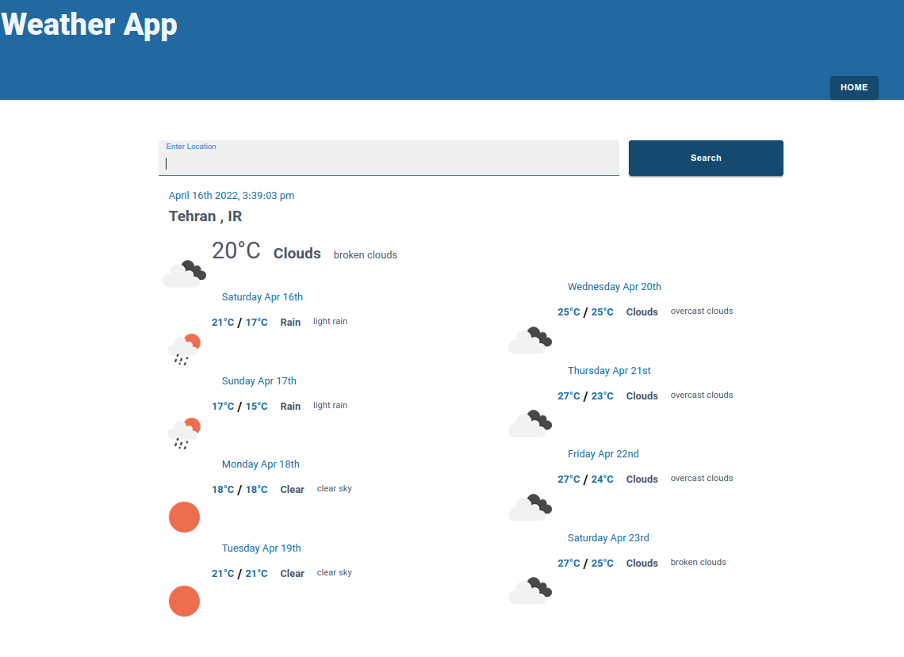

<p>
  <a href="https://m-ghalevand.ir/app/todo_app" target="_blank">
    
  </a>
  <a href="https://m-ghalevand.ir/app/post_app" target="_blank">
    
  </a>

  <a href="https://m-ghalevand.ir/app/weather_app" target="_blank">
    
  </a>
</p>

این سایت با تکنولوژیهای زیر ساخته شده است

- next-pwa
- next
- react
- redux toolkit
- axios
- moment
- swiper
- scss
- material UI
- font awesome
- tailwindCss


##`app` در صفحه

از ریداکس اتقاده شده است 
##    داریم که هر کدام وظیفه خود را دارندstate 4

آدرس سایت
###`https://m-ghalevand.ir`

##install package
```bash
yarn install
# or
npm install
```
##run project
```bash
yarn dev
# or
npm run dev
```